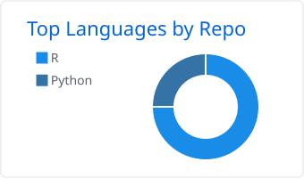
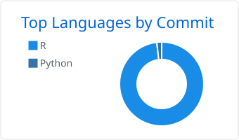

<div align="center">


[](https://www.linkedin.com/in/sebalucas/)
[](mailto:sebalucas@gmail.com)
[](https://cran.r-project.org/package=bigbang)
[](https://sebollin.r-universe.dev/)
[](https://orcid.org/0009-0009-9068-0276)

🇺🇾

[](README.md)

</div>

---

## 👋 Who I am

An education graduate who became a data scientist. **Seventeen years of work**:
I started inside a classroom and now work inside the data — the state's cash
transfers, a university's procurement, and any problem that lets itself be
modelled. The question is always the same: what does this data say, and what can
it not say?

- 🏛️ **Data analyst** at Uruguay's **National Directorate for Transfers and Data Analysis ([DINTAD](https://www.gub.uy/ministerio-desarrollo-social/))**, Ministry of Social Development, as a **[UNFPA](https://uruguay.unfpa.org/)** consultant: managing and analysing the cash-transfer programmes for households in socio-economic vulnerability.
- 🎓 **Data analyst** at **[SeCIU](https://www.seciu.edu.uy/)**, Universidad de la República: institutional dashboards and data visualisation in **R** and **Shiny**.
- 📚 **Coordinator of extracurricular workshops** at a public secondary school, since 2016; thirteen years in secondary education came before this. I did not drop it when I changed fields, and I do not plan to.
- 🔬 Currently doing an **MSc in Data Science** (CPAP–FIng, Universidad de la República).
- 🌐 I keep the front-end and the maintenance of **[komorebibonsai.uy](https://komorebibonsai.uy)** running — that is where I write the code with no statistics in it.
- 🌳 I grow bonsai.

**Auditable before automatic**: I show scope, evidence and uncertainty before
I show a convenient answer.

> **En resumen** — Licenciado en Educación devenido científico de datos, 17 años
> de trabajo. Construyo herramientas auditables en R para datos de política
> pública. → **[Versión en español](README.md)**

---

## 📦 R packages

<table>
<tr>
<td width="50%" valign="top">

### 🌌 [bigbang](https://github.com/sebollin/bigbang)

**On CRAN.** Builds *tidyverse*-style meta-packages from local package archives
(`.tar.gz` / `.zip`). Made for teams behind an institutional firewall: it works
offline.

```r
install.packages("bigbang")
```

[](https://cran.r-project.org/package=bigbang)
[](https://www.repostatus.org/#active)
[](https://cran.r-project.org/package=bigbang)
[](https://github.com/sebollin/bigbang/actions/workflows/R-CMD-check.yaml)
[](https://app.codecov.io/gh/sebollin/bigbang)
[](https://sebollin.github.io/bigbang/)
[](https://doi.org/10.5281/zenodo.23192961)

</td>
<td width="50%" valign="top">

### 🔎 [lupa](https://github.com/sebollin/lupa)

Data profiling, quality measurement and duplicate search at scale, and
**auditable**: it states the scope, evidence and uncertainty of every result,
and never changes your data silently.

```r
install.packages("lupa", repos = c(
  "https://sebollin.r-universe.dev",
  "https://cloud.r-project.org"))
```

[](https://sebollin.r-universe.dev/lupa)
[](https://www.repostatus.org/#active)
[](https://github.com/sebollin/lupa/actions/workflows/R-CMD-check.yaml)
[](https://sebollin.github.io/lupa/)

</td>
</tr>
<tr>
<td colspan="2" valign="top">

### 🗺️ [geouy](https://github.com/Richard-Detomasi/geouy) · co-author

Official geographic data for Uruguay —layers from INE, IDE, MIDES, MTOP and
the environment ministry, among others— ready to use in R as `sf` objects.
Created and maintained by [Richard Detomasi](https://github.com/Richard-Detomasi).
It spent five years on CRAN until it was archived in 2025; the work is bringing
it back: finding out what broke, fixing it, and getting it ready to return.

```r
pak::pak("Richard-Detomasi/geouy")
```

[](https://cran.r-project.org/package=geouy)
[](https://www.repostatus.org/#active)
[](https://cran.r-project.org/package=geouy)
[](https://github.com/Richard-Detomasi/geouy/actions/workflows/R-CMD-check.yaml)
[](https://cran.r-project.org/web/views/Spatial.html)
[](https://doi.org/10.5281/zenodo.3610246)

</td>
</tr>
</table>

`bigbang` and `lupa` can also be installed from **[sebollin.r-universe.dev](https://sebollin.r-universe.dev/)**.
`bigbang` and `geouy` are listed in Estación R's [catalogue of Latin American R packages](https://github.com/Estacion-R/asombrosos-paquetes-r-latinoamerica),
and their hex stickers are in the [hexSticker gallery](https://github.com/GuangchuangYu/hexSticker#stickers-for-software-packages).

---

## 🏗️ What I have built

- 📊 **UdelaR procurement monitor** *(SeCIU)* — around **100,000 purchases** in a [Shiny](https://shiny.posit.co/) dashboard with several visualisations and cross-filters, hand-written CSS included.
- 🏛️ **[tus-ipm-microsimulacion](https://github.com/sebollin/tus-ipm-microsimulacion)** — microsimulation of how increases in Uruguay's *Tarjeta Uruguay Social* affect **multidimensional poverty** (ECH 2025): aggregate results, reproducible figures, and the methodological architecture.
- 🧰 **[lupa](https://github.com/sebollin/lupa)** and **[bigbang](https://github.com/sebollin/bigbang)** — the two tools above; I wrote them because I needed them and they did not exist.
- 🗺️ **CARTOGRAFÍA URGENTE** — survey and analysis of the geographic distribution of educational provision for children and adolescents in Montevideo.

And after hours: optimisation and forecasting models for problems nobody cares
about except me. Still private.

---

## 🤝 Contributions to other projects

### 🔤 [ftfy](https://github.com/rspeer/python-ftfy) — mojibake repair

Three fixes proposed to the reference library for repairing mojibake, by
[Robyn Speer](https://github.com/rspeer):
[detecting and fixing KOI8-R](https://github.com/rspeer/python-ftfy/pull/234),
[Windows-1252 mojibake of U+2000 block symbols](https://github.com/rspeer/python-ftfy/pull/235),
and [a regex anchor that swallows the trailing newline in the CESU-8 codec](https://github.com/rspeer/python-ftfy/pull/237).

---

## 🛠️ What I work with

<div align="center">

**Languages**


**Environments and version control**


**Data, models and visualisation**


**Databases**


**Systems and publishing**


**Geographic information**


</div>

---

## 🎓 Education

<table>
<tr><td><strong>MSc in Data Science</strong> <em>(ongoing)</em></td><td>CPAP – FIng, Universidad de la República</td></tr>
<tr><td><strong>Postgraduate Specialist in Data Science</strong></td><td>CPAP – FIng, Universidad de la República</td></tr>
<tr><td><strong>BA in Education</strong></td><td>Universidad Católica del Uruguay</td></tr>
<tr><td><strong>GIS and Environmental Innovation</strong></td><td>Universidad Católica del Uruguay</td></tr>
<tr><td><strong>Technical degree in Leisure and Recreation Education</strong></td><td>Universidad Católica del Uruguay</td></tr>
</table>

---

## ✍️ Publications, talks and awards

- **[{DADverse}. Simplifying data processing for public policy aimed at vulnerable populations in restricted-use environments](https://github.com/LatinR/presentaciones-LatinR2023/blob/main/papers/slides/DADverse.pdf)** — Lucas, S.; Detomasi, R. *LatinR 2023*.
- **La Siembra. El legado de Aulas Comunitarias: un aporte a la educación uruguaya** — co-author of ch. 1.3.2. OBSUR, 2020.
- **[El aula en movimiento: aportes metodológicos desde la Educación No Formal](https://www.gub.uy/ministerio-educacion-cultura/sites/ministerio-educacion-cultura/files/documentos/publicaciones/Revista_Enfoques_5.pdf)** — Catalurda, R.; Lucas, S.; González, W. *Enfoques, Revista de Educación No Formal*, Ministry of Education and Culture, v. 5, 2014.
- **Talleres en el liceo… ¿para qué?** — Lucas, S.; Verdún, N. Talk at the «Alicia Goyena» Chair (CES–ANEP), 2016.
- 🏆 **«Todo Suma» project** — creator and project lead. Winner of the *Concurso sobre Proyectos de Convivencia de los Centros Educativos*, Pelota al Medio a la Esperanza programme.

---

## 📊 GitHub

<div align="center">

<picture>
  <source media="(prefers-color-scheme: dark)" srcset="assets/tarjetas/1-repos-per-language.github_dark.svg" />
  
</picture>
<picture>
  <source media="(prefers-color-scheme: dark)" srcset="assets/tarjetas/2-most-commit-language.github_dark.svg" />
  
</picture>

</div>

---

<div align="center">

**Want to work together?** — [LinkedIn](https://www.linkedin.com/in/sebalucas/) · [sebalucas@gmail.com](mailto:sebalucas@gmail.com)

<sub>Ciudad de la Costa, Canelones · Uruguay 🇺🇾</sub>


</div>
